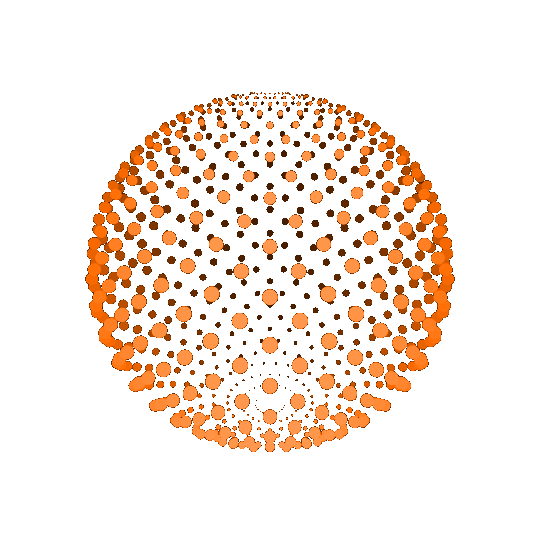
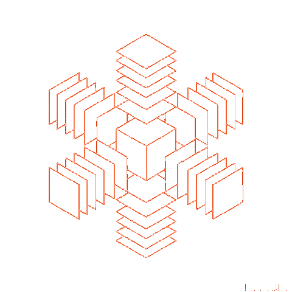
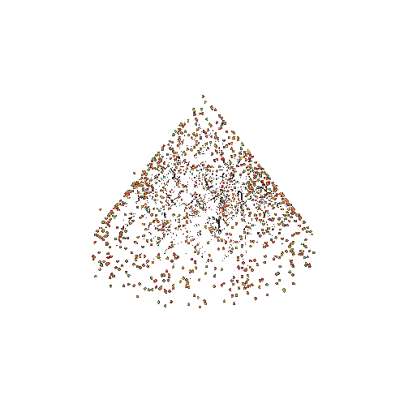
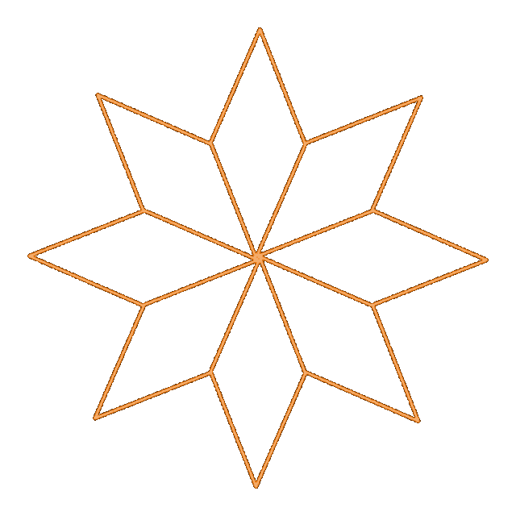
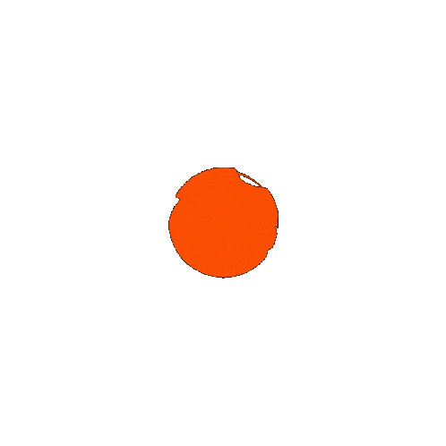

  

  
  
   
  

  <h1>
  hey there
  
</h1>

### :man_technologist: About Me :
I am a Backend Python Developer .                                                  - :telescope: I’m working as a Software Engineer and contributing to frontend and backend for building web applications.

- :seedling: Exploring Technical Content Writing.

- :zap: In my free time, I solve problems on LeetCode. 

- :mailbox:How to reach me:                                

   Мой стек:      

