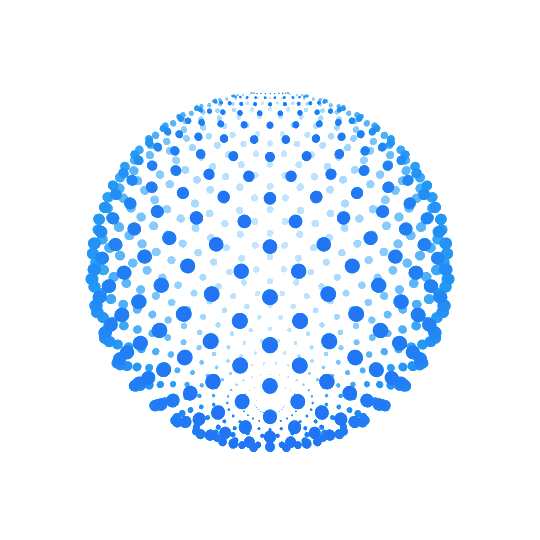
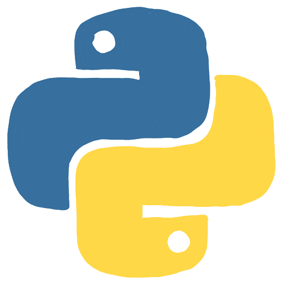

<table>
    <tbody>
    <tr>
        <td style="width: 50%;">
          

            
          

            
            
             
            
          

          

        </td>
     <td style="width: 50%;">

    <h4>About Me 
    My name is Roman and I am Backend Python Developer </h4>

- :telescope: I created websites and API services in Django(DRF) 

- :seedling: I am currently studying
FastAPI ,
and SQLAlchemy 

- :zap: In my free time, I solve problems on LeetCode. 

- :mailbox:How to reach me:  
        

        Languages and Tools:  
        &nbsp;
        &nbsp;
        &nbsp;
        &nbsp;
        &nbsp;
        &nbsp;
        &nbsp;
        &nbsp;
        &nbsp;
         

    </tr>
</tbody></table>
